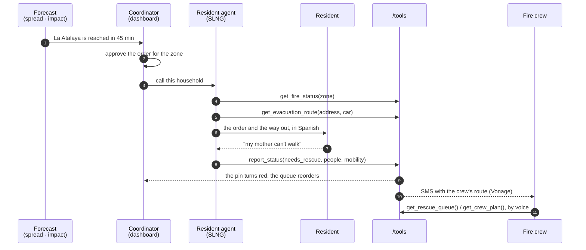
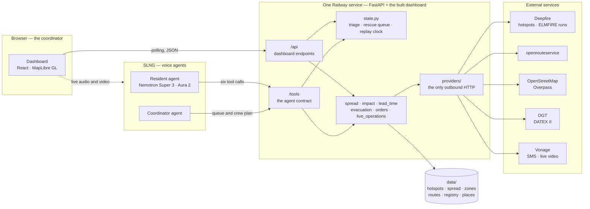
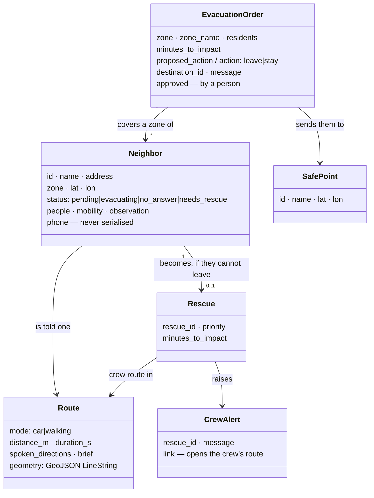
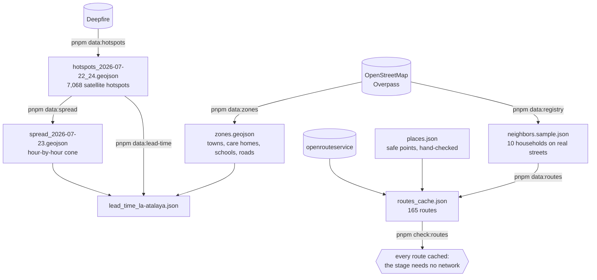

# HackFire

**A voice agent that calls residents before a wildfire reaches them, tells them how to get out, and shows the emergency coordinator who needs rescue.**

Built at [HackBarna 2026](https://www.hackbarna.com/en/events/aisummit26) (19–20 September, Norrsken House Barcelona) for the Norrsken / Deepfire "AI for Wildfire" challenge, track 4: *values at risk*.

> Every resident who evacuates on their own is a rescue the firefighters don't have to make.

## The problem

On 23 July 2026 the Burgohondo wildfire in Ávila ran 3 km in 40 minutes and reached the La Atalaya housing estate in El Tiemblo. Between 1,200 and 1,300 people were evacuated from it and 5 homes were destroyed ([sources](docs/findings/2026-09-19-press-figures.md)).

Public alerting today is one-way and impersonal. ES-Alert broadcasts the same message to a whole area and does not listen: the coordinator does not know who has left, who never got the message, and who cannot move. Rescues surface late, through saturated 112 lines, when crews are already committed.

## How it works

1. **The fire and where it is heading.** Deepfire satellite hotspots on a map with a time slider, and an hour-by-hour predicted spread. Live mode shows fires burning now; replay mode reproduces 23 July 2026.
2. **Who is in its path.** The predicted spread is intersected with towns, housing estates, care homes and roads from OpenStreetMap. Each zone gets a time to impact.
3. **The agent calls residents in the at-risk zones.** It gives each one a route out, on foot or by car, that avoids the predicted fire, and asks whether they can leave on their own, how many they are, and what they can see.
4. **Triage for the coordinator.** Each resident becomes *evacuating*, *no answer* or *needs rescue*. Rescues are ranked by time to impact, pushed to the fire crew, and can be queried by voice.

Calls are triggered by the prediction, hours ahead, while cell towers still work. "No answer" is a signal too: it tells the coordinator where to send a patrol.

One household, end to end:



## What is real and what is fictional

- **Real:**
  - the fire data: Deepfire's satellite hotspots of 23 July 2026, and in live mode the fires burning now in Spain with Deepfire's ELMFIRE spread simulations;
  - places and roads from OpenStreetMap;
  - routes from openrouteservice;
  - the voice agents, which are real AI agents on SLNG.
- **Fictional, for the demo:**
  - the residents and their homes, and what they answer;
  - the calls in the replay, the evacuations and the crew alerts.

  Nobody near the real fire was called. The dashboard and the landing page say so on screen.

## Status

Hackathon build, deployed at **https://frontend-production-ae2c.up.railway.app** (one Railway service; see [Deployment](docs/setup/deployment.md)). The page that presents the project to judges and visitors is at **https://frontend-production-ae2c.up.railway.app/about**. What works today:

- Backend with the five agent tools, an in-memory triage state and a prioritised rescue queue. All five tools are real: `report_status`, `get_rescue_queue`, `get_fire_status` and both routing tools.
- Dashboard with a map of the demo area, resident pins coloured by triage state, live counts and the rescue queue, polling the backend every 2 seconds.
- Replay of the fire: 7,068 Deepfire satellite hotspots from 22–24 July 2026, cached in `data/`, on a time slider with play and pause. Hotspots are coloured by age and sized by fire radiative power.
- Live mode: a toggle switches the map to Deepfire's active fire clusters right now, refreshed every minute. If Deepfire is down, the page shows a message and the replay keeps working.
- Predicted spread and zones at risk: for the replay of 23 July, a cone from the front's velocity gives a forecast every 30 minutes, drawn hour by hour on the map, and the panel lists the places in its path (La Atalaya, El Tiemblo, care homes, schools, health centres, roads) with their time to impact. `get_fire_status` answers from the same numbers, for the moment the slider is on.
- Lead time: La Atalaya is flagged 6 h 8 min before the first satellite hotspot comes within 3 km of it, computed from satellite data only ([how](docs/findings/2026-09-19-lead-time.md)) and shown on the dashboard once the slider passes the flag.
- Evacuation routes: `get_evacuation_route` and `get_rescue_route` are real. Residents go to the nearest safe point the forecast does not reach, avoiding the area burned by the scenario time plus the next hour of predicted spread; crews avoid only what has burned ([why](docs/findings/2026-09-19-evacuation-destinations.md)). Click a resident on the map to see their route by car or on foot, and the directions the agent reads them. Demo routes are cached in `data/`.
- Evacuation orders per zone: the system proposes a destination (or staying indoors) for each zone with residents, the coordinator approves or changes it, and the agent reads that order to everyone in the zone, then gives each resident their own route to it.
- Demo mode: a typed answer (classified by the LLM) or three buttons replace a failed call, map tiles are cached for a flaky network, and Reset restores everything between rehearsals. See [docs/demo/runbook.md](docs/demo/runbook.md).
- Voice agents (Unmute packages in `voice/`), both deployed on SLNG with Nemotron Super 3 and Deepgram voices: the resident agent opens with the zone's order and route, asks the three questions and records the answer; the coordinator agent reads the rescue queue and gives the crew's route while the dashboard draws it (**Ask the coordinator agent**). Deploy both with `pnpm voice:deploy`, which also sets their Spanish goodbye.
- Calls (#8): once a zone's order is approved, **Call residents** phones every pending resident through SLNG and turns unanswered calls into *no answer*. There is no SIP trunk yet, so this stays off (`HACKFIRE_PHONE_CALLS`), and the coordinator takes a resident's call in the browser instead: select the resident → **Call … (answer here)**.
- Crew alerts: every new *needs rescue* creates an alert with the address, people, mobility and a link that opens the dashboard on the crew's route from the El Tiemblo fire station. Shown on the dashboard, and texted to the crew by SMS once Twilio credentials are set.

Still to build: outbound phone calls, which need a phone number (#8). See [PLAN.md](PLAN.md) and the issues.

## Architecture

A single repo, run on localhost and deployed straight from `main` as one Railway service: the backend serves the API, the agent tools and the built dashboard on one URL ([Deployment](docs/setup/deployment.md)). No staging environment.



Everything on the demo path reads `data/`. `providers/` is the only code that talks to the network, and
`config.py` the only code that reads the environment — so a provider that is slow, rate-limited or down
changes one module, not the demo.

```
frontend/src/
  domain/      Types and pure functions. No React, no fetch, no styling
  services/    Backend client: the only place that knows URLs and HTTP
  hooks/       State and polling; returns plain data
  ui/          Presentational components, theme and CSS. Props in, markup out
backend/app/
  main.py      Dashboard API (/api) and agent tools (/tools)
  models.py    The tool contract
  state.py     Triage state, rescue prioritisation and the replay clock
  spread.py    Predicted spread: a cone from the front's velocity
  impact.py    Which zones the predicted spread reaches, and when
  config.py    Every key, URL and path, read from the environment in one place
  providers/   One module per external service: Deepfire, openrouteservice, SLNG, Twilio
  pipelines/   One-off data downloads that write to data/
data/          Static demo data: resident registry, cached hotspots and spread
```

The UI is independent of the logic: redesigning the dashboard means touching `ui/` only. No component kit and no icon library; the one third-party UI dependency is MapLibre GL.

| Piece | Technology |
|---|---|
| Fire data and spread | [Deepfire API](https://docs.deepfire.co/llms.txt) |
| Voice, calls and SMS | [SLNG](https://docs.slng.ai/llms.txt) |
| LLM | NVIDIA Nemotron Super 3, served by [SLNG](https://docs.slng.ai/llms.txt) to the voice agents and, through its Context Router, to the backend |
| Routing | [openrouteservice](https://openrouteservice.org/) with `avoid_polygons` |
| Places at risk | OpenStreetMap via Overpass |

### Agent tool contract

The voice agents talk to the rest of the system through six HTTP tools under `/tools`:

| Tool | Purpose |
|---|---|
| `get_fire_status(zone)` | State of the fire front and time to impact for a zone |
| `get_evacuation_route(address, mode)` | Walking or driving route that avoids the predicted fire |
| `report_status(neighbor_id, status, people, mobility, observation)` | Record what the resident said; updates triage |
| `get_rescue_queue()` | Rescues ranked by priority |
| `get_crew_plan()` | Which crew goes to which rescue, and whether each arrives in time |
| `get_rescue_route(rescue_id)` | Route for the fire crew |

Interactive docs are served at `http://localhost:8000/docs`.

What the tools move around, and what the dashboard draws:



A resident's status is set only by `report_status`, from what they actually said. Nothing else writes it,
so the queue the coordinator sees and the queue the crew agent reads are the same object.

## The data pipelines

Everything slow or external is fetched **once, before the demo**, and committed under `data/` as a static
file. The live demo reads files; it does not wait on anyone's API. Each pipeline is a command, each command
writes one file, and `--check` rebuilds in memory and compares instead of writing.



| Command | Reads | Writes | Network | When to run |
|---|---|---|---|---|
| `pnpm data:hotspots` | the scenario's box and dates | `hotspots_*.geojson` | Deepfire | once per scenario |
| `pnpm data:zones` | the scenario's box | `zones.geojson` | Overpass | once per scenario |
| `pnpm data:registry` | `zones.geojson` | `neighbors.sample.json` | Overpass | when the registry changes |
| `pnpm data:spread` | the cached hotspots | `spread_*.geojson` | — | after new hotspots |
| `pnpm data:lead-time` | hotspots, spread, zones | `lead_time_*.json` | — | after either changes |
| `pnpm data:routes` | registry, places, spread | `routes_cache.json` | openrouteservice | after the registry or safe points change |
| `pnpm check:routes` | registry, places, routes | — | none (or one URL) | before every demo |

Two rules keep this honest. **No scenario in code:** the box, the dates, the scenario time and the file names
live in `data/scenarios/<id>.json` and are read through `app/scenario.py`, so another fire is another file
([new scenario](docs/setup/new-scenario.md)). And **the network is never on the demo path:** `pnpm check:routes`
fails if a single route would need openrouteservice on the day. Live mode is the exception by design — it calls
Deepfire and the DGT for fires burning right now, and falls back to the last good answer when they are slow.

## Scalability and current limitations

This is a hackathon demo, and the honest picture has three layers.

**What already works on any fire.** Live mode takes any active fire in Spain from Deepfire, with its ELMFIRE
simulation (terrain, fuel, weather), and derives the places in its path from OpenStreetMap with a time to
impact, a draft CAP 1.2 alert per place and the roads to close, cross-checked against the DGT's live incidents.
No demo data is involved. The replay workflow is scenario-driven end to end, and a synthetic fire exercises the
whole chain in the tests.

**What is bound to this demo.**

| Limitation | Where | What it would take |
|---|---|---|
| **Only registered residents can be called.** `get_evacuation_route` answers `404 Address not in the registry`; there is no inbound number and no way to create a resident mid-call | `main.py`, `state.py` | A SIP trunk, plus geocoding the address the caller says (Nominatim) and creating the household there and then |
| **Triage state lives in memory**, one process, and a redeploy resets it | `state.py` | Postgres or Supabase behind the same interface; the tool contract does not change |
| **Safe points are five hand-checked places** around the demo box, and `safest_point()` picks the nearest one that is ≥3 km clear of the fire and outside the 6-hour forecast | `data/places.json`, `evacuation.py` | The same Overpass query that finds places at risk, inverted: shelters, sports halls and schools outside the cone |
| **Routes are pre-planned**; live mode lists the roads to close but plans no exit for anyone | `routes_cache.json`, `live_operations.py` | Routing per zone rather than per household, and a self-hosted router |
| **openrouteservice's free plan**: 2,000 directions a day and 40 a minute per key (three keys, rotated on a spent quota) | `providers/routing.py` | Self-host openrouteservice or Valhalla; the ceiling is the plan, not the algorithm |
| **`avoid_polygons` caps at 200 km² / 20 km**, so the fire is clipped to a 14 km square around each route | `evacuation.py`, [finding](docs/findings/2026-09-19-ors-avoid-polygon-limit.md) | A router that takes a set of closed roads instead of a polygon — a 50 km front does not fit in one |
| **No phone line.** Calls happen in the browser; the agent never dials a real number in the demo | `voice/`, SLNG | A SIP trunk. Concurrency is then a contract, not code |

**What the routing is, and is not.** It is an algorithm, not an evacuation plan: it avoids what has already
burned plus the next hour of predicted spread, and sends people to the nearest safe point the forecast does not
reach — crews get the opposite, avoiding only what has burned, because they have to get close. It knows nothing
about road capacity, contraflow, how many people were already sent that way, or the assembly points a civil
protection plan defines. That plan belongs to the authority; what HackFire adds is the call, the answer, and the
coordinator knowing who cannot leave on their own. The rest of the gap — whose registry, on what legal basis,
who approves an order — is written down in [what works for a real fire](docs/demo/real-life.md).

## Running it locally

The full guide, with troubleshooting, is in [docs/setup/new-machine.md](docs/setup/new-machine.md). In short:

**1. Tools.** Git, Node 20+, pnpm 10, and [uv](https://docs.astral.sh/uv/) (it fetches Python 3.12 by itself). On Windows, use WSL2.

```bash
corepack enable                                    # pnpm, at the version pinned in package.json
curl -LsSf https://astral.sh/uv/install.sh | sh    # uv; open a new shell afterwards
```

**2. Clone and install.**

```bash
git clone https://github.com/RogerTito455/hackfire.git
cd hackfire
pnpm bootstrap  # frontend and backend dependencies (not `pnpm setup`, which is a pnpm built-in)
```

**3. Keys.** `cp .env.example .env` and fill in the keys you have; [docs/setup/environment.md](docs/setup/environment.md) says what each one unlocks. The skeleton runs without any of them.

**4. Run**, in two terminals:

```bash
pnpm dev:api    # backend  — http://localhost:8000
pnpm dev:web    # frontend — http://localhost:5173
```

To try the triage flow without the voice agent:

```bash
curl -X POST localhost:8000/tools/report_status \
  -H 'Content-Type: application/json' \
  -d '{"neighbor_id":"n02","status":"needs_rescue","people":2,"mobility":"cannot walk"}'
```

The pin for that resident turns red and they appear in the rescue queue. `POST /api/reset` restarts the demo.

### Tests

```bash
pnpm check      # backend tests, then frontend type-check and build
```

### Resident registry

`data/neighbors.sample.json` holds placeholder residents and is safe to commit. For the demo, copy it to `data/neighbors.local.json` (git-ignored) and put in real addresses and the team's own phone numbers. Phone numbers are never returned by the API.

## Documentation

[docs/](docs/README.md) holds everything beyond this page: setup, one page per external service (Deepfire, SLNG, openrouteservice and the sponsor extensions), Claude Code with the project's MCP servers and skills, the development workflow, and a dated log of findings. [PLAN.md](PLAN.md) remains the source of truth for scope and decisions.

## A note on the real fire

The demo replays a real event from two months ago in which people lost their homes. Our headline figure, *lead time*, is computed from satellite data only: the gap between the moment the system flags a zone as at risk and the moment hotspots reach it. We make no claim about what the emergency services did or when.

## License

[MIT](LICENSE)
